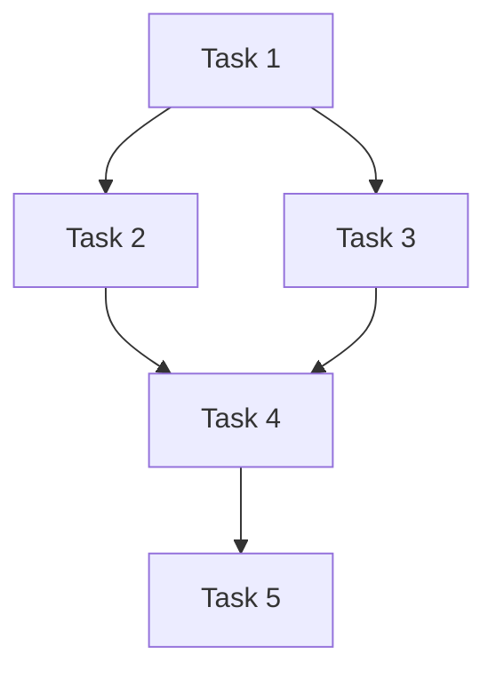

# Task Breakdown Template

## Tasks Overview
[High-level overview of all tasks]

## Critical Path Tasks
### Task 1: [Task Name]
**Priority**: High
**Status**: Not Started
**Description**: [Detailed description]
**Acceptance Criteria**:
- [ ] [Criterion 1]
- [ ] [Criterion 2]
**Dependencies**: [List of dependencies]
**Estimate**: [Time estimate]

### Task 2: [Task Name]
**Priority**: High
**Status**: Not Started
**Description**: [Detailed description]
**Acceptance Criteria**:
- [ ] [Criterion 1]
- [ ] [Criterion 2]
**Dependencies**: [List of dependencies]
**Estimate**: [Time estimate]

## Secondary Tasks
### Task 3: [Task Name]
**Priority**: Medium
**Status**: Not Started
**Description**: [Detailed description]
**Acceptance Criteria**:
- [ ] [Criterion 1]
- [ ] [Criterion 2]
**Dependencies**: [List of dependencies]
**Estimate**: [Time estimate]

### Task 4: [Task Name]
**Priority**: Medium
**Status**: Not Started
**Description**: [Detailed description]
**Acceptance Criteria**:
- [ ] [Criterion 1]
- [ ] [Criterion 2]
**Dependencies**: [List of dependencies]
**Estimate**: [Time estimate]

## Cleanup Tasks
### Task 5: [Task Name]
**Priority**: Low
**Status**: Not Started
**Description**: [Detailed description]
**Acceptance Criteria**:
- [ ] [Criterion 1]
- [ ] [Criterion 2]
**Dependencies**: [List of dependencies]
**Estimate**: [Time estimate]

## Task Dependencies

## Timeline
- **Week 1**: Task 1, Task 2
- **Week 2**: Task 3, Task 4
- **Week 3**: Task 5

## Quality Checks
- [ ] All tasks completed
- [ ] All acceptance criteria met
- [ ] No blockers remaining
- [ ] Ready for deployment